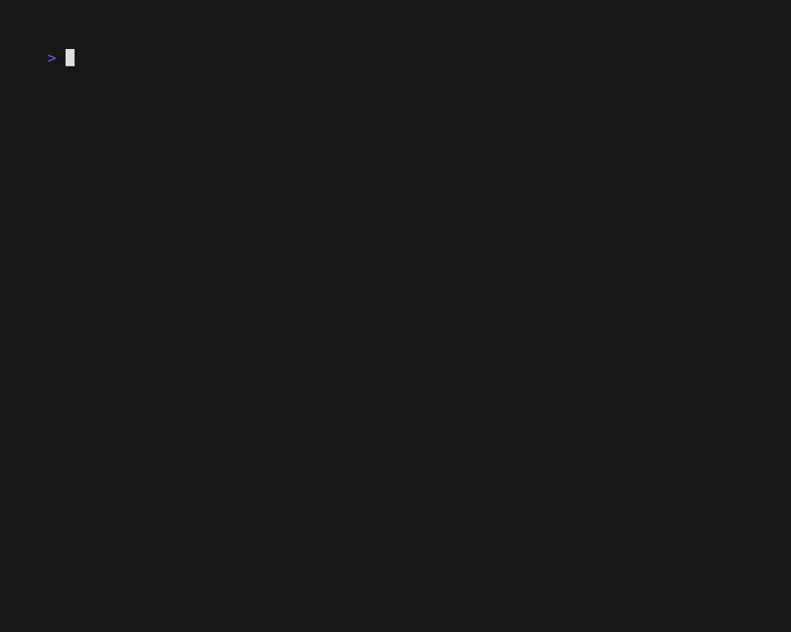

# a CLI and go SDK for the Synology: `synoctl` and `synology-go`

## Why make this?

Synology NAS devices are popular.

In a home setting, a Synology device is particularly handy as a small, always-on Linux device with abundant local storage.

Out of the box, you can interact with a Synology device through a web-based UI. The Web UI is great for trying new features,
but managing containers or network drives from the UI can be slow and error-prone - classic motivations for a scriptable command-line utility.

The `synoctl` command name follows the tradition of `kubectl`, `journalctl`, `sysctl` and other cli utilities for
managing things.
Hopefully it is easy to type and easy to remember!

## Getting Started with `synoctl`

You can download a precompiled `synoctl` binary from the releases tab in this repository.

Run the `synoctl login` and follow the prompts to authenticate with your Synology host

## Commands for the Container Manager App

`synoctl` supports these commands. You'll need to install the Container Manager app from Package Center first.

| app    | resource   | command         | description                                                               |
|--------|------------|-----------------|---------------------------------------------------------------------------|
| docker | manager    | logs            | prints logs from the Container Manger app                                 |
| docker | containers | list            | lists all containers                                                      |
|        |            | restart         | restarts container specified with --name flag                             |
|        |            | stop            | stops container specified with --name flag                                |
|        |            | start           | starts container specified with --name flag                               |
|        |            | logs            | prints container logs from target container                               |
| docker | projects   | build           | builds the project specified with --id                                    |
|        |            | create          | creates a new project from a name, share path, and `compose.yaml`         |
|        |            | get             | gets a project by id                                                      |
|        |            | list            | lists all projects                                                        |
|        |            | start           | starts the project specified with --id                                    |
|        |            | stop            | stops the project specified with --id                                     |
|        |            | update          | updates the `compose.yaml` contents for the project specified with --name |
| docker | images     | get             | gets a single image by --name and --tag                                   |
|        |            | list            | lists all images downloaded to the Container Manager instance             |
|        |            | pull            | starts a pull task for a --repository and --tag                           |
|        |            | upgrade         | starts an upgrade task for a --repository                                 |
|        |            | follow-pull     | polls the status of a previously started pull task                          
|        |            | follow-upgrade  | polls the status of a previously started upgrade task                     |

All commands provide a `--help` command explaining their use.

## Thanks

Making a terminal animation with [VHS](https://github.com/charmbracelet/vhs) was super fun

I came across many examples of folks analyzing and creating clients for the DSM API. Of those, these were particularly informative:
* https://github.com/Xboarder56/SynoDockerContainerUpgrade
* https://github.com/cccheng/ruby-synowebapi/tree/master
* https://github.com/garrettdieckmann/synologyapi

The Synology API has some interesting self-documenting behavior, but parameters for API calls are not documented.
Watching live requests in the developer console while using the Synology UI is the best strategy - the UI is a web application,
and it appears to rely on the same APIs that this client library calls.
